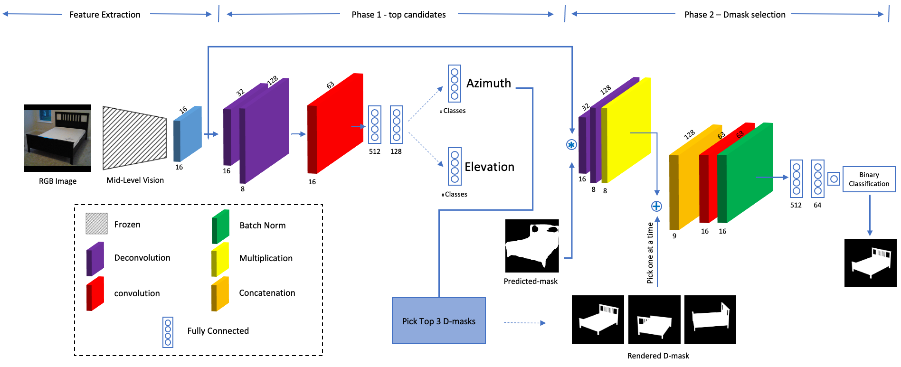
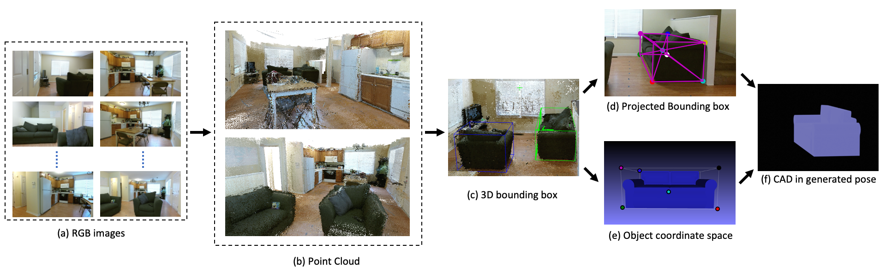

# Object Pose Estimation using Mid-level Visual Representations

PyTorch implementation and models for **Object Pose Estimation using Mid-level Visual Representations**.

**Object Pose Estimation using Mid-level Visual Representations** is a simpler alternative to complex pose estimation pipelines. In which the mide-level representions can be
useful for different downstream tasks.

More details in the paper ["Object Pose Estimation using Mid-level Visual Representations"](https://arxiv.org/abs/2203.01449).

**AVD annotation for pose and Training Instructions** will be availble soon.

# Model Architecture
First stage: up-sampled and fused mid-level feature maps (not the actual normal and re-shading
images) are used to predict azimuth and elevation. Second stage: The object mask and mid-level features are compared with
the top three object D-masks corresponding to most likely pose hypotheses from the first stage.

# AVD Labeling Pipeline for Pose Annotation
The pose labelling pipeline for main object categories in AVD. Using (a) RGB and depth images of each scene, we
reconstructed the (b) dense 3D point-cloud of each scene. (c) The 3D bounding boxes of objects inside these point clouds
are annotated using the LabelCloud tool. (f) Poses are generated using the PNP algorithm between (d) the corners projected
on the image plane and (e) corners in object coordinate frame. In total, we have labeled 6337 objects pose and 3D bounding
box.

